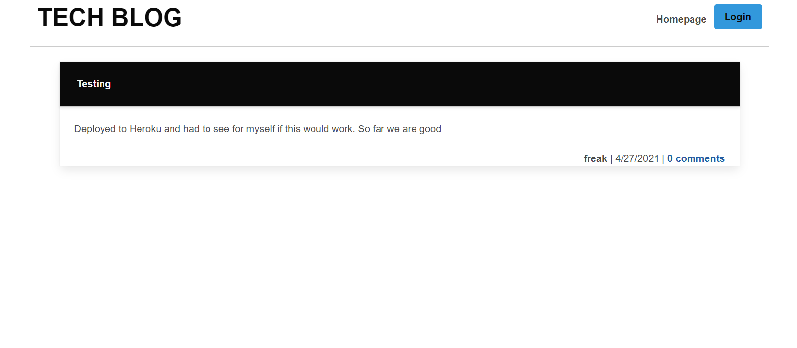

# MVC-tech

## Description:
Developers can publish their blog posts and comment on other developers' posts.

## Licensing:

## Table of Contents 
* [Description](#description)
* [Installation](#installation)
* [Usage](#usage)
* [Technology](#technology)
* [Questions](#questions)
* [Screenshot](#screenshot)

## Installation:
- express-handlebars 
- MySQL2 
- sequalize
- dotenv
- bcrypt
- express-session 
- connect-session-sequelize 

## Usage:
https://calm-fjord-73302.herokuapp.com/

## Technology:
- Express
- Sequalize
- MySQL2
- Node

## Questions:
Please reach me through my Github account or email with any additional questions.
- Github: [tessaustin](https://github.com/tessaustin)
- Email: tessaustin92@gmail.com 

## Screenshot:

